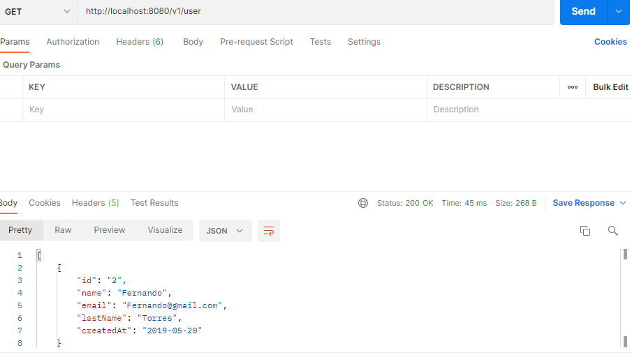

# Spring Boot Rest API
Learning Objectives

## Part 1: Implementing the Users Microservice RESTFUL API

1. Create a new package called dto and inside define your UserDto object with at least the following fields:

- name.
- email.
- lastName.
- createdAt.

2. Create a new package called data and inside define your User data object with at least the following fields:
- id.
- name.
- email.
- lastName.
- createdAt.

3. Create a new package called service an inside create the following interface:

4. Create an implementation of the UserService using a HashMap data structure inside.
Make your service implementation UserServiceHashMap injectable using the @Service annotation.

5. Create a new package called controller and create a new class UserController inside.
Annotate your UserController so it becomes a REST Controller, Inject your UserService implementation inside the UserController via the constructor:

6. Download and install Postman and test ALL the endpoints of your API.

### Post

### Put

### Delete

### Get

